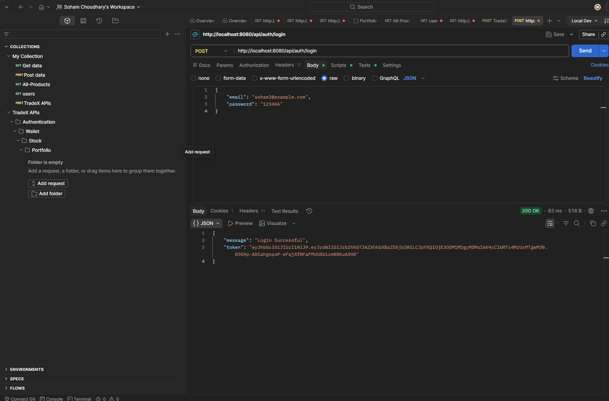
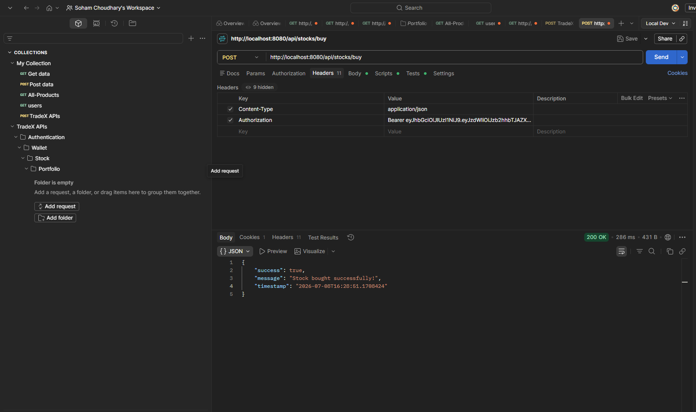
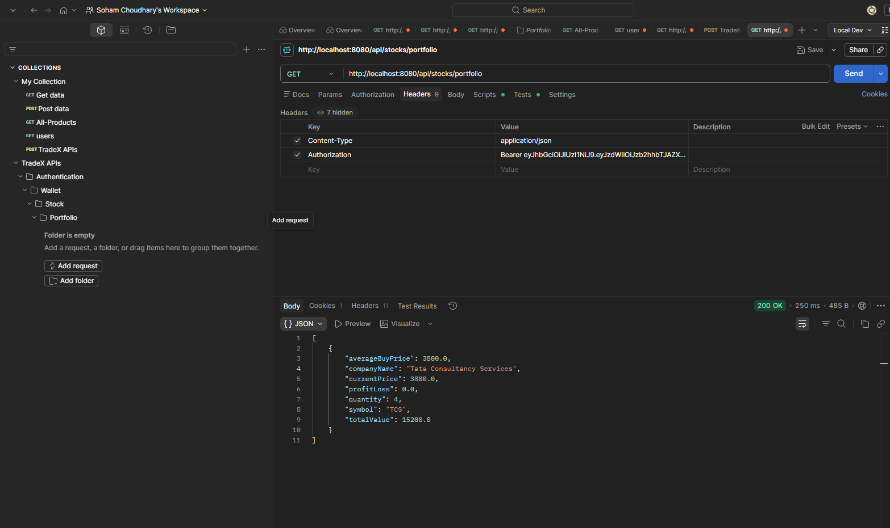
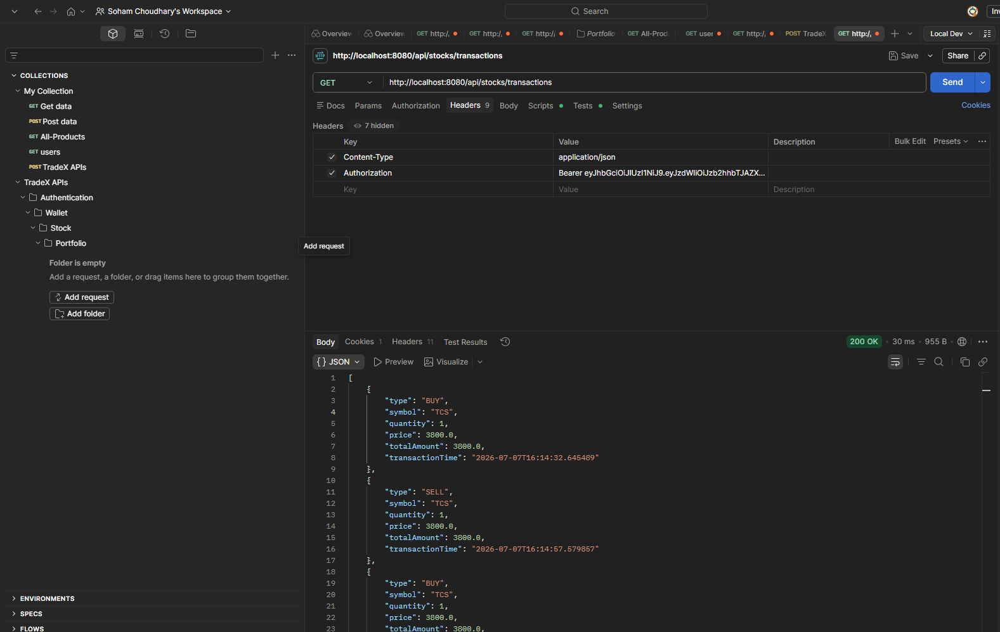
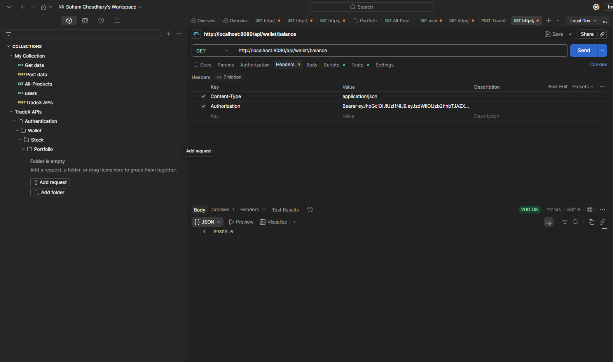

# 📈 TradeX - Stock Trading Platform

## 📌 Overview

TradeX is a secure stock trading backend application developed using Java and Spring Boot. It allows users to register, log in using JWT authentication, manage a wallet, buy and sell stocks, track their portfolio, and view transaction history.

The project follows a layered architecture using Controllers, Services, Repositories, DTOs, and JPA Entities.

---

## 🚀 Features

### Authentication
- User Registration
- User Login
- JWT Authentication
- BCrypt Password Encryption
- Protected REST APIs

### Wallet
- Automatic Wallet Creation
- Add Money
- View Wallet Balance

### Stock Management
- Add Stock
- View Stocks
- Search Stock

### Trading
- Buy Stock
- Sell Stock

### Portfolio
- View Holdings
- Average Buy Price
- Profit / Loss Calculation

### Transaction History
- Buy History
- Sell History

---

## 🛠 Tech Stack

- Java 21
- Spring Boot
- Spring Security
- JWT
- Spring Data JPA (Hibernate)
- MySQL
- Maven
- Swagger (Work in Progress)

---

## 🏗 Project Architecture

```
Controller
     │
Service
     │
Repository
     │
MySQL Database
```

---

## 📂 Project Structure

```
src
 ├── controller
 ├── service
 ├── repository
 ├── entity
 ├── dto
 ├── config
 ├── exception
 └── util
```

---

## 🔐 Authentication Flow

```
Register
     │
Login
     │
Generate JWT
     │
Client Stores Token
     │
Authorization: Bearer <JWT>
     │
JWT Filter
     │
Protected APIs
```

---

## 📈 Trading Flow

```
Login
     │
Buy Stock
     │
Wallet Deduction
     │
Stock Quantity Update
     │
Portfolio Update
     │
Transaction History
```

---

## 📊 Future Enhancements

- Live Stock Price API
- Admin Dashboard
- Email Notifications
- Docker Deployment
- Redis Caching
- Role Based Access Control
- Unit Testing

# 📸 API Screenshots

## 🔐 Login API



---

## 💰 Buy Stock API



---

## 📊 Portfolio API



---

## 📜 Transaction History API



---

## 👛 Wallet Balance API



---

## 👨‍💻 Developer

**Soham Choudhary**

Java Backend Developer